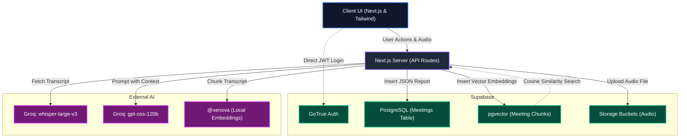

# System Architecture

Below is the technical architecture for AuraMeet AI, mapping the flow of data from the client UI, through our Next.js API layer, and out to our respective AI and Database microservices.

